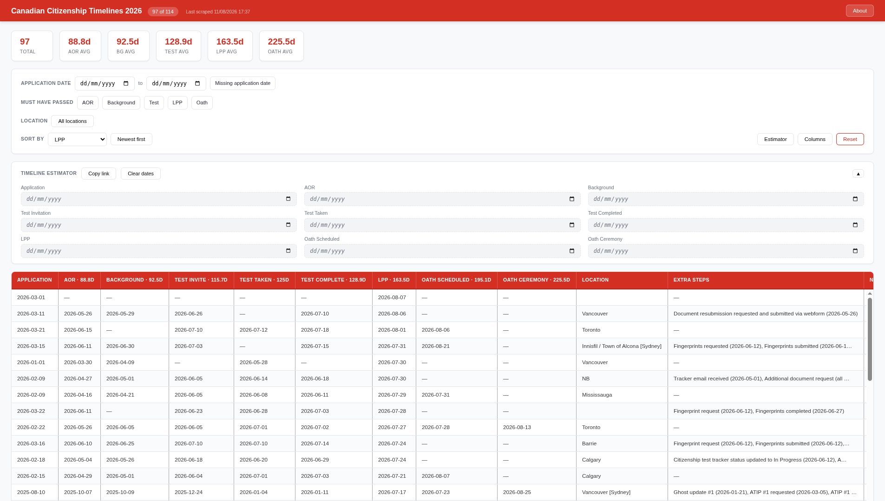

# Canadian Citizenship Timelines 2026

Scrapes r/ImmigrationCanada citizenship timeline comments, extracts structured data via an LLM, and serves an interactive dashboard.



## Setup

**Requirements:** Node.js >= 18, a Reddit account cookie, and an OpenAI-compatible LLM API endpoint.

```bash
git clone https://github.com/ImranR98/citizen-timeline.git
cd citizen-timeline
npm install
cp .env.example .env
```

Edit `.env` with your credentials (see comments in `.env.example`). To get your Reddit cookie: log into Reddit, open DevTools → Application → Cookies → copy the entire cookie string.

## Run

```bash
node main.js
# → Dashboard at http://localhost:3000
# → Scrapes immediately, then every 24 hours (configurable via SCRAPE_INTERVAL_HOURS)
```

One-off scrape:

```bash
node scrape.js                 # Full pipeline
LLM_TEST_MODE=1 node scrape.js # Process 5 random comments only
```

Test extraction on a single comment:

```bash
node reddit.js <comment_id>
node reddit.js --show-prompt <id>
```

## Docker

```bash
docker build -t imranrdev/cct26 .
docker run -d --name cct26 -p 3000:3000 \
  -v ./data:/app/data \
  -e REDDIT_COOKIE="..." -e LLM_BASE_URL="..." -e LLM_MODEL="..." -e LLM_API_KEY="..." \
  imranrdev/cct26
```

## License

MIT — see [LICENSE](LICENSE)
